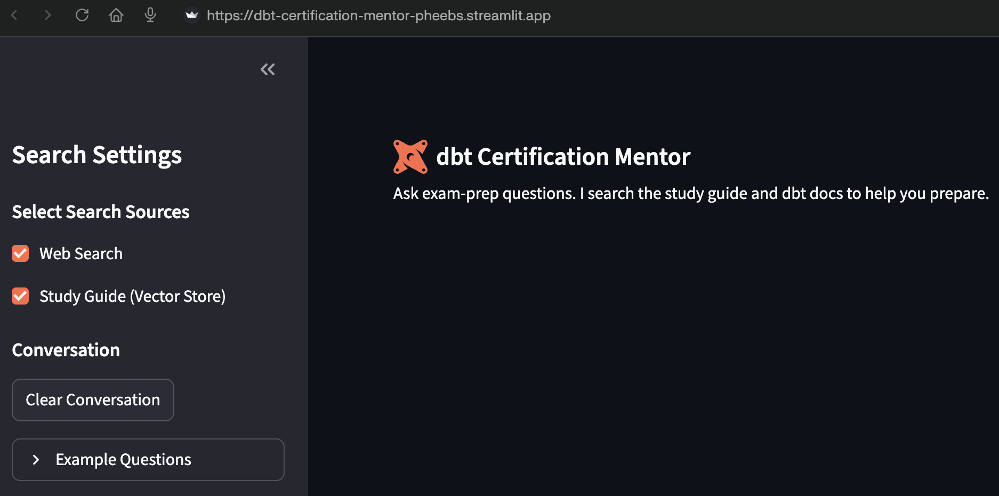

# dbt Certification Mentor

**Exam-prep chat for the [dbt Certified Developer exam](https://www.getdbt.com/certifications/analytics-engineer-certification-exam)** — dig into **incremental strategies** (merge, insert_overwrite, adapter quirks), **snapshots vs incrementals for slowly changing dimensions**, **tests / severity / contracts**, or “what’s actually on this exam?”, and get answers grounded in the **official study guide** plus **live web search** when you want fresher docs or blog takes. Citations, not vibes.

Under the hood it’s **Python** + **Streamlit**, **OpenAI Agents SDK**, default model **`gpt-4.1`** (override with `OPENAI_AGENT_MODEL` if your key needs something else). **File search** hits your vector store copy of the study guide; **web search** reaches dbt Learn, docs, and the wider internet. Flip either off in the sidebar if you want pure RAG or pure “ask the internet” mode.

**UI:** Streamlit chat — search toggles, example prompts, conversation memory.

<p align="center">
  
</p>

Full-length example (BigQuery incremental strategies, structured answer + table): [`assets/demo-gpt-4.1.png`](assets/demo-gpt-4.1.png).

---

## Try it

**Start with the live app** if you just want to poke at it: no clone, no `.env`, no vector store — **[dbt-certification-mentor-pheebs.streamlit.app](https://dbt-certification-mentor-pheebs.streamlit.app)**. Good for demos, sharing with teammates, or cramming on a phone.

**Run locally** when you want **your own** OpenAI billing, **private** threads, or you’re hacking `prompt.txt` / `app.py`. Setup is below. (This README skips “deploy your own Streamlit Cloud fork”; treat the hosted URL as the public demo.)

---

## Setup (local only)

### 1. Create a vector store and upload the study guide

The app expects an OpenAI vector store that contains the official PDF.

**Option A — setup script (recommended)**

1. Grab the PDF from [dbt Learn — study guide](https://learn.getdbt.com/learn/article/analytics-engineering-exam-study-guide).
2. Drop it under `study_guide/` in this repo.
3. With `OPENAI_API_KEY` already in `.env`:

```bash
uv run python setup_vector_store.py "study_guide/dbt_Certificate Study Guide_Analytics_Engineer_Developer.pdf"
```

(Adjust the filename if yours differs.)

4. Paste the printed `vector_store_id` into `.env`.

**Option B — OpenAI Platform**

1. [Vector stores](https://platform.openai.com/storage) → create store → upload the PDF.
2. Copy the `vs_…` id into `.env`.

### 2. Environment

```bash
cp .env.example .env
# OPENAI_API_KEY + vector_store_id (see .env.example for optional knobs)
```

### 3. Run

```bash
uv sync
uv run streamlit run app.py
```

Open the URL Streamlit prints (usually http://localhost:8501). Run from this directory so **`.streamlit/config.toml`** picks up the dbt-orange theme for light/dark.

---

## Architecture

- **Pattern:** One **`Agent`** with hosted tools (no handoffs).
- **Tools:** **`FileSearchTool`** (study guide vector store) + **`WebSearchTool`**.
- **Model:** default **`gpt-4.1`**; set **`OPENAI_AGENT_MODEL`** to swap (e.g. if your org 404s on 4.1).
- **Config:** `prompt.txt` = system instructions; `app.py` wires Streamlit + `Runner.run`.

Deeper diagrams: [`docs/ARCHITECTURE.md`](docs/ARCHITECTURE.md) (Mermaid).

---

## Example questions

- What topics are covered on the dbt Certified Developer exam?
- Compare **snapshots** vs **incremental models** for slowly changing dimensions
- What are best practices for **incremental** models?
- How do I configure **tests** for a model?
- Suggest a study plan for the certification

---

## Notes

- **Not** affiliated with dbt Labs; **dbt** is a trademark. The study guide comes from their Learn site — bring your own PDF if policies change.
- The **hosted** app uses the maintainer’s API quota; **local** = your usage, your keys, your logs.
- **`vector_store_id`** must belong to the **same** OpenAI org as **`OPENAI_API_KEY`** or file search 404s in exciting ways.

---

## Project structure

```
dbt-mentor-agent/
├── assets/               # README screenshots (UI, demo)
├── docs/
│   └── ARCHITECTURE.md   # Mermaid flowcharts
├── app.py                # Streamlit + agent
├── prompt.txt            # Mentor system prompt
├── setup_vector_store.py # One-shot store + upload
├── requirements.txt
├── pyproject.toml
├── .env.example
└── README.md
```
