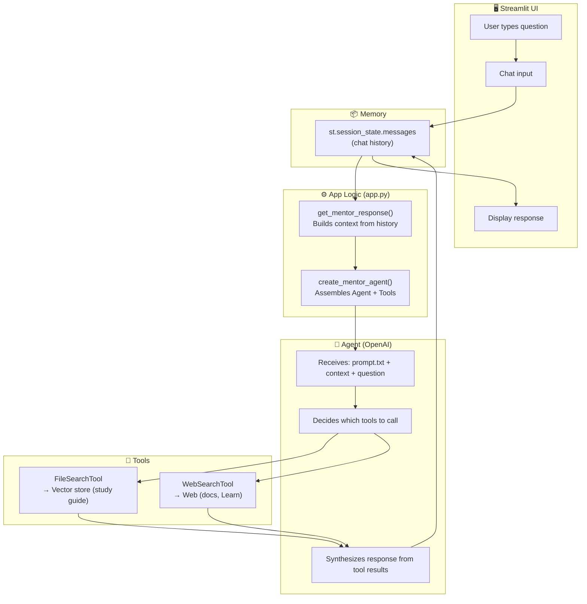
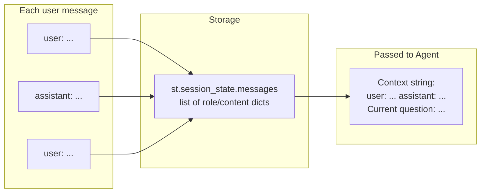
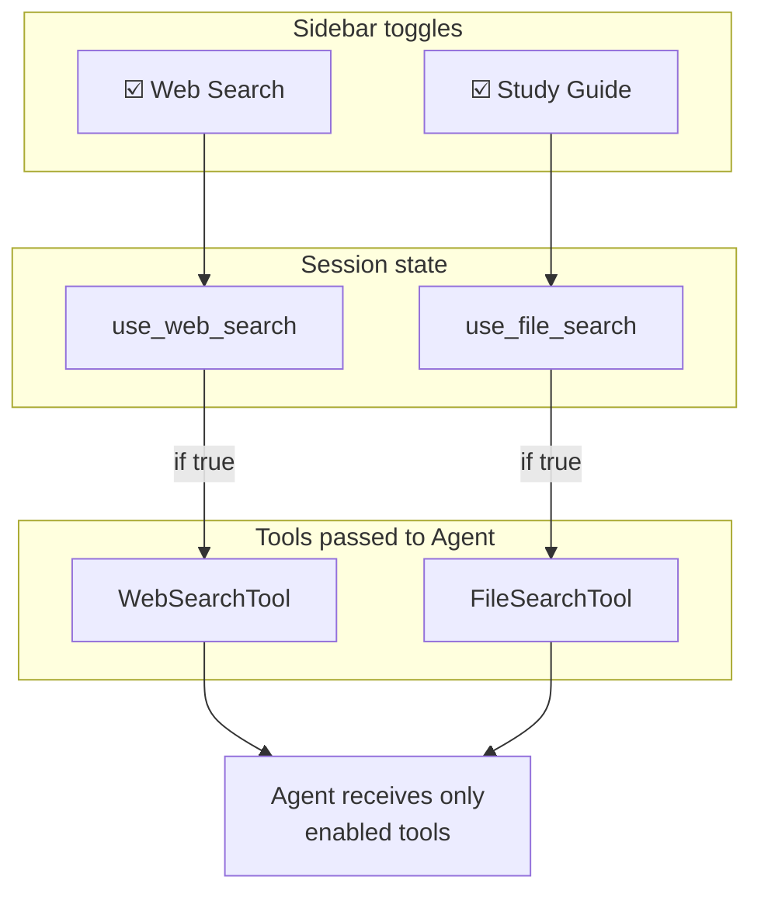
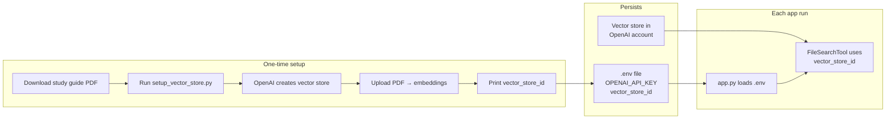

# Architecture: dbt Certification Mentor Agent

Visual flow of how components work together — similar to no-code workflow diagrams (e.g. n8n).

---

## Main Flow: From Question to Answer

---

## Data Flow: Context & Memory

---

## Tool Selection (User Toggles)

---

## Setup: Vector Store & .env

---

## File Map

| File | Role |
|------|------|
| `app.py` | Streamlit UI, session state, agent orchestration |
| `prompt.txt` | System prompt (agent instructions) |
| `setup_vector_store.py` | One-time: create vector store, upload PDF |
| `.env` | Secrets: API key, vector_store_id |
